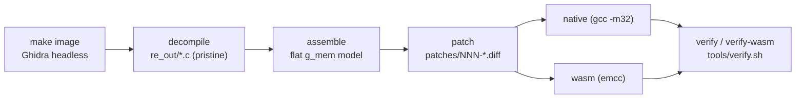
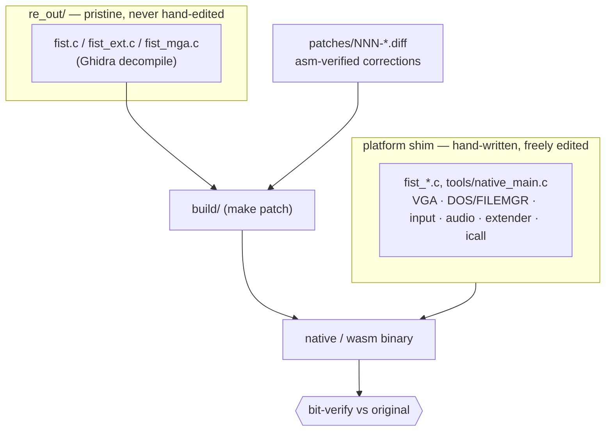
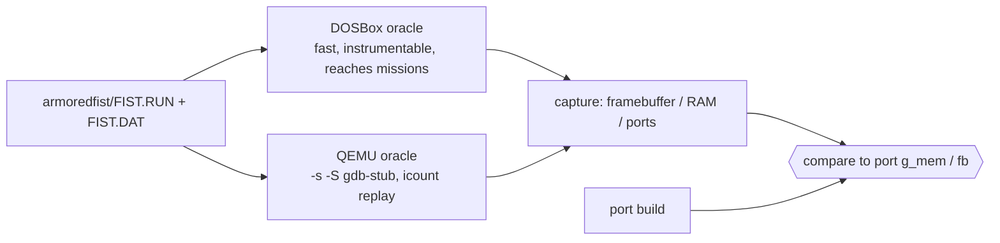

# Armored Fist (1994) — native + WebAssembly

**THE FRAME IS BIT-IDENTICAL.** Given the same input and RNG state, this port produces the same 320×200
palette framebuffer and the same audio stream as NovaLogic's original *Armored Fist* running under
DOSBox/QEMU — every frame, every menu, every mission — and the native and WebAssembly builds are
byte-identical to each other. That is a falsifiable target: two byte streams either match or they do not,
and any deviation is by definition a bug we can find and close.

## What this file is

Vision, architecture, and approach — the shape of the work and the rules it runs by. It is the map, not
the territory: it says how the engine is built and how we know a change is right. It carries no status and
no findings. **The board carries those** (see *The board*): every open capability, every discovery, every
decision lives as one file under `board/`, and the git history carries what was done. Read this file to
orient; read the board to know what is next.

## What this is built on

The method is already proven end-to-end. `~/Git/wasm-dd2/` took *Destruction Derby 2* — a DOS-era
commercial game — all the way to a complete, bit-verified native+WebAssembly port through many patient
test/fix iterations. Armored Fist shares no code with it (DD2 is Win32/DirectDraw; AF is 32-bit DOS
protected-mode) but inherits the method and the discipline verbatim. AF is in several ways the easier
target: no COM/Win32/DirectDraw layer, one linear 320×200×8bpp framebuffer, deterministic under
DOSBox/QEMU. **It has already been done once; it is being done again.**

## Stance

- **Code is the truth.** Every claim is verified against `armoredfist/FIST.RUN` / `FIST.DAT` (static via
  `objdump -m i8086`, or a live DOSBox/QEMU run). No approximations, no band-aids, no stubs.
- **"Geht nicht gibt es nicht."** The whole chain is proven, so nothing here is unreachable — only
  bounded, decomposable work. When something looks hard, it is the next thing to break into a small,
  verifiable step, never a reason to declare a surface out of reach.
- **Land small, verify immediately.** One asm-verified patch that makes one flow bit-identical on both
  targets is a real win. Bank it, verify both targets, move on. Breadth grows one bit-verified surface at
  a time.
- **A finding is a discovery.** A failing test names a bug in the code, not the test. A disproven
  hypothesis is progress — it eliminates a dead end. Correcting course is the method working.

## The target

`FIST.RUN` is a loader plus a Doug-Huffman DOS-extender (mapped to the platform shim). **`FIST.DAT`
(216 KB) is THE ENGINE** and the decompile target: 16-bit segmented, base 0, almost entirely hand-written
assembly (Kyle Freeman), NovaLogic **Voxel-Space** terrain in the Comanche lineage. The port runs it under
a flat memory model:

- one `uint8_t g_mem[]` array is the entire address space;
- **DGROUP** lives at linear `0x1c000` (SS=DS=DGROUP=0x1c00);
- the VGA framebuffer is at `0xA0000`; the extender/overlay image loads at `0x100000`;
- game data lives under `armoredfist/FISTDATA/` (`.KLC` maps, `.MS3` missions, `.FSG` battles, `.M##`
  models, `.FSG/FSE/FSW` sounds & briefings, palette archives, …).

## NovaLogic optimizations (the idioms that shape the decompile)

Kyle Freeman's 1994 hand-written asm squeezes a 386 with tricks that dominate the reverse-engineering, so
recognizing them is half the work:

- **Segment registers as a fourth address dimension.** `mov [mem],cs` / `push cs` SAVE the running code
  segment so a later `lcall [mem]:off` reconstructs a far pointer back into that code with no per-call
  relocation math; `ES`/`DS` are loaded once and reused across `rep movs/stos` blits. These implicit
  segment carries are invisible to a decompiler run without CS/ES context — which is exactly why **~184 of
  397 patches (46%) are one class: restoring a segment base Ghidra dropped** (`unaff_CS`/`unaff_ES`, far-ptr
  seg, string-op base). board:0010 tracks fixing this at the Ghidra-parameter root instead of per site.
- **Multiple code segments (CS clusters).** The engine is not single-segment: `CS=0x1000` (main engine,
  linear `0x10000+`), a `CS=0xf69` CRT/service cluster (window `0xf690..0x1f68f`, straddling `0x10000`, so
  it physically overlaps the 0x1000 code), and a small `e000` region. Near `rel16` call/jmp wrap inside
  their own segment's 64 KB window; Ghidra's flat page grid wraps them at the wrong boundary
  (`SegWrapFixup.java` repairs this per-instruction).
- **Voxel-Space terrain** (Comanche lineage): a column-major ray-cast over a heightmap, **fixed-point
  integer only** (no FP in the raycaster), per-column texel walk (`689a` sky/tile resample → `6980`
  raycaster → `9200` tile→fb writer). Determinism-relevant: no x87 rounding to diverge native↔wasm.
- **Cooperative timing on a PIT tick.** `[0x452]` (frame timer) is bumped by the INT-8 sub-handler; the
  engine spin-waits on tick counters, so time "passes" only when the pump runs — the seam the port drives
  cooperatively (`fist_timer_pump`).

## The chain

Everything starts with `make` — the target chain *is* the documentation (`make help`).



- **image / decompile** — Ghidra headless (`x86:LE:16 Real Mode`, base 0) produces the pristine decompile,
  with register dataflow threaded via a custom `__allregs` model.
- **assemble** — a mechanical transform of the decompile into the flat `g_mem` model (forward decls,
  `ghidra_compat.h`).
- **patch** — every engine correction is one commented, asm-verified `patches/NNN-slug.diff`, applied
  `-F0 --fuzz=0` onto `re_out/` to produce `build/`. Each patch header carries its rationale; drift fails
  loudly.
- **native / wasm / verify** — both targets build from the same patched `build/`, and `tools/verify.sh`
  runs the bit-verify flow matrix on each.

## Architecture: three trees, one requirement



Two things are authored by hand and nothing else: the **patches** (each an asm-verified engine correction)
and the **platform shim** — VGA (linear `0xA0000` + DAC → framebuffer), DOS/FILEMGR (INT 21h), mouse /
keyboard / joystick (INT 33h / INT 9 / port 0x201), SB/GUS + OPL audio, the PIT/INT 8 timer, the
extender/overlay loader, and indirect-call dispatch. The decompile stays pristine; the shim may grow.

## Code is the truth: the oracle



Two oracles verify every claim. **DOSBox** is fast and hackable — instrument it to dump the framebuffer,
guest RAM, or I/O ports at a chosen tick; it reaches missions. **QEMU** gives a gdb-stub and record/replay
for true protected-mode inspection. A rebuilt instrumented DOSBox relocates the engine's DGROUP to a known
guest physical address, so any engine field is directly comparable byte-for-byte to `g_mem`. For the
windshield, `tools/oracle/capture_battle_burst.sh` grabs the original spawn under stock DOSBox and selects
the frame whose dashboard matches the port, giving a provenance-verified framebuffer reference without
needing guest RAM.

### Toolchain inventory (present in-repo — these are the working tools, not external deps)

- **Ghidra** `third_party/ghidra_12.1.2_PUBLIC` (headless) + JDK `third_party/jdk-21.0.11+10`, project DB
  `third_party/fist_ghidra_proj/*.rep` (reused across runs; `FIST_FRESH=1` re-imports). Driver:
  `tools/decompile.sh` (`make image`→`fist_dat_image.bin`→decompile). Pipeline order (all in
  `tools/ghidra/`): `PrepAnalysis` (aggressive analyzers + **DS/SS** segment context) → `MarkEntry` →
  `SeedServiceVecs`/`SeedRuntimeVecs` → `RecoverAll` (jump-table/prologue fixpoint) → `SegWrapFixup`
  (CS-cluster near-flow repair; discovers the `0xf69`/`0x1000` clusters) → `InstallIntFixup` (INT→reg-file)
  → `ApplyConv` (custom `__allregs` model, register threading) → `SegmentFixup` (DS-provably-CS) →
  `ExportDecomp`. **CS and ES context are NOT yet set** (`PrepAnalysis`) — the board:0010 gap.
- **Patched DOSBox** `third_party/dosbox-fist` (instrumented; DGROUP relocated to a known guest phys addr so
  engine fields diff byte-for-byte vs `g_mem`). Terrain/voxel oracle: `tools/oracle/capture_9200_framematched.sh`
  and `capture_6980_framematched.sh` (`FIST_R9200CAP`: frame-matched {globals, VRAM, DAC, tile} per 9200
  pass). 1:1 320×200 references land in `ref/` via `tools/refcapture_*.sh` (e.g. `refcapture_intro.sh`).
  Scripts default `DOSBOX=/tmp/debs/dosbox-fist`; point them at `third_party/dosbox-fist`.
- **QEMU** `qemu-system-i386` (gdb-stub `-s -S`, icount replay) for protected-mode inspection.

**Dynamic write-trace (the "SQL-trace" of the running game).** The patched DOSBox hooks EVERY guest memory
access (`fist_memrec`/`FIST_MEMREAD_HR` on `host_writeb/w/d` + reads in `mem.h`), so a run reconstructs the
application's behaviour from its accesses the way a SQL trace reconstructs an app from its queries. Arm it
with `FIST_MEMARM_BOOT=1 FISTLOG=<prefix>` plus a target: `FIST_WATCHPHYS=<phys> [FIST_WATCHSPAN=N]` logs
every write in a physical window with the LIVE `cs:eip`, `ss:sp`, value, and a 20-word stack dump
(`<prefix>.watch.txt`) — i.e. WHO (which code segment + IP) wrote WHAT WHERE; `FIST_WATCHFLAT=<flat>
[FIST_WATCHFLATSPAN=N]` is the CR3-aware variant that follows a flat linear address through the extender's
paging (`cr3`), and `FIST_TILEPHYS` records the per-byte last-writer of a 64 KB window. Use it to recover
ground-truth register/segment values (e.g. the real CS behind a `mov [mem],cs`), to find the writer of any
diverging byte, or to map a subsystem's data flow. Caveat: the 16-bit engine runs UNDER the extender's PM
paging (`cr3=0xe000`), so an engine DGROUP field is NOT at guest phys `0x1c000` — use `FIST_WATCHFLAT`
(CR3-aware) with the engine-flat linear, or read `dsb`/`csb` from a `capture_9200`/`_6980` `.cam.txt` to
locate the relocated DGROUP first.

## What decides done

Completeness is the DD2 standard — every menu, screen, and dialog; every campaign mission and map; every
setting (detail level, sound devices, input modes, serial link); and the built-in level/mission editor as
a first-class deliverable with a bit-verified round-trip (create → save → reload → simulate,
byte-identical). The gate: a subagent confirms the WASM build error-free and fully functional **ten
consecutive times** on the complete exhaustive test matrix — one failure resets the count to zero. As the
matrix grows to drive every surface named above, re-passing the gate is what turns "the matrix passes"
into "the port is done." `tools/wasm_gate.sh` runs the endurance.

## The board

`board/` is the canonical work state, and this section is its only statement — a convention written twice
is the defect the board removes. Three directories and the path is the state: `board/open/` ·
`board/active/` · `board/closed/`. There is no fourth: *blocked* is a line in a body naming what blocks,
and the task stays open. One task
is one file — an RFC 822 header, a blank line, a markdown body — named `NNNN_description.md`. An item says
what **will be true**: a title is a capability the tree gains, a closed item is a sentence that begins
*this engine can*. The board may be extended and may not be shortened. Code cites a requirement with a
`board:NNNN` marker in a comment; the board never names the code. Findings become items the round they are
found — a discovery that lives only in a report is lost at the next context boundary.

```
ls board/active/                                     # what is in flight
cat board/*/0042_*.md                                # one item, wherever it lives
grep -l '^Type: bug'      board/active/*.md          # by kind
grep -l '^Parent: 0007'   board/*/*.md               # a feature's children
git grep -n 'board:0042'  -- src/ test/              # every site that implements or proves it
git mv board/active/X.md  board/closed/              # the transition IS the diff
```

## Conventions

- **English throughout** the repository — files, headers, commit messages, board items, code comments.
- `re_out/` stays pristine; corrections are `patches/NNN-*.diff`; `make check` must apply every patch.
- **Verify both targets after every change** — native ↔ wasm byte-identity is a hard invariant.
- Original files under `armoredfist/` are present at run time and read-only; `third_party/` and extracted
  images are gitignored.
- Git commits and PRs carry no "Co-Authored-By: Claude" or "Generated with Claude Code" attribution.
- Diagrams are welcome — mermaid, because it renders and ASCII rots at the first edit.
