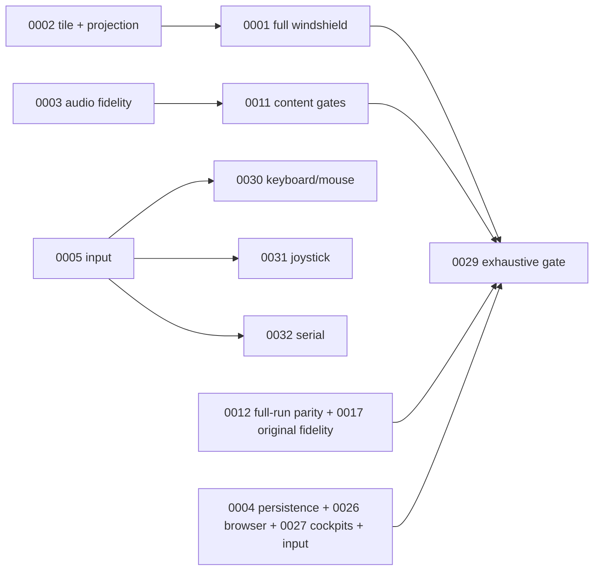

# Developer work queue

Read `../AGENTS.md`, then the selected work item and its dependencies. The directory is the state:
`open/`, `active/`, `closed/`. An active item records ownership, not higher confidence in its diagnosis.

## Execution protocol for Sol

1. Take one bounded **Next** step. Confirm the cited behavior in current patched code or a fresh run.
2. Treat **Evidence** as scoped observations. Historical results need their recorded revision;
   **recommendations** are proposed designs, not established facts or permission to alter the original.
3. Capture the first differing presented frame or PCM sample, identify its original producer,
   and recover the register,
   segment, width and flag contract. Patch that contract and its dependent consumers together.
4. For implementation changes use `make check`, build native and WASM, then run
   `bash tools/verify.sh both`. Separate native/wasm passes omit cross-target comparisons in some
   branches. Add the reaching regression flow; a green unrelated matrix does not validate a fix.
5. Replace the item's current evidence/next step after the run. Record revision, exact command,
   expected/observed result and evidence path. Do not append another session transcript.
6. Close only when **Accept** is demonstrated. Move partial work back to open with the missing proof.
   If original behavior or required input is unknown, obtain it before implementing dependent code.

Use isolated game-data copies for runs that write profiles. Preserve original assets. For a failing
experiment, retain the decisive counterexample and next discriminating measurement, not every guess.
Do not delete tests, weaken comparisons, mask observable differences or zero unknown registers to pass.

Internal memory/register/write equality is diagnostic. Acceptance compares full frame/audio output
and timing under matched inputs. Persistent/editor files retain their explicit round-trip contracts.

## Work order

Continue an explicitly assigned item first. Otherwise use this order; independent work need not wait
for unrelated proof. This is a dependency/feedback order, not a claim that every task blocks all others.

| Order | Work items | Deliverable |
| --- | --- | --- |
| 1 | 0033 → 0034 → 0012 | Strict output checks, synchronized sequence capture, full-run parity. |
| 2 | 0002 → 0001, 0027 | Strict existing terrain replay, full render chain, all cockpits. |
| 3 | 0017 | Reproduce and remove behavior differences caused by guest/host address representation. |
| 4 | 0003 → 0011 | Matched audio event/sample traces, mixer fidelity, content gates. |
| 5 | 0026, 0004, 0005 → 0030/0031/0032 | Browser timing, persisted progression, gameplay input/link. |
| As reached | 0009, 0010, 0013–0015, 0019, 0022/0023/0025/0028 | Bounded service, ABI, width, memory or tooling defects. |
| Final | 0029 | Complete surface inventory, visual proof and fresh ten-run WASM gate. |



## Ownership and completion coverage

| Requirement | Owner |
| --- | --- |
| Whole windshield, all battles/detail/night modes | 0001; stage proofs 0002 |
| Vehicle consoles, dynamic instruments, radar, loss/switch transitions | 0027 |
| Full-run presented-frame/PCM parity and timing | 0012; strict checks 0033, sequence capture 0034 |
| Original simulation, objectives, outcomes and debrief | 0017 |
| OPL, digital effects, mixer and device configurations | 0003; content regression fixtures 0011 |
| Profiles, campaign progression, reload behavior | 0004 |
| Keyboard/mouse, joystick variants, two-player serial | 0005 and children 0030–0032 |
| PIT/retrace/interrupt ordering and interactive browser pacing | 0026 |
| Every menu, screen, dialog and setting; level/mission editor create/save/reload/simulate | 0029 coverage inventory |
| Missing services/dispatch, segment/width/pointer correctness | 0009/0010/0014/0015/0019/0022/0023/0025/0028 |
| Oracle capture and diagnostic code/memory recovery | 0024 (delivered), 0013, 0035 |

No requirement is discharged by a matching verdict, a prefix hash, a silent identical WAV, a
no-trap sample, a colour histogram, or a masked frame without an independently proved mask.

## Work-item format

RFC 822 header (`Type`, `Title`, optional `Parent`/`Depends`), blank line, Markdown body.
One stable numeric ID per task; use `board/*/NNNN_*.md` to find it. No duplicate Status field.

Open items contain **Contract**, scoped **Evidence** when available, ordered **Next**, and **Accept**.
Keep implementation pointers where they help reproduce or decide the work; do not paste source bodies.
Split independently deliverable work into children. Closed items retain capability, bounded proof and
follow-up owner. A disproven bug is explicitly marked as disproven. Update this index when ownership changes.

## Consolidation provenance

This rewrite consolidates the board as recorded at revision
`7fb23e5f26716b0dd1d90c30b3fb7a8807ac9bee`. Historical measurements above were not all rerun during
editing. The complete prior notes, rejected experiments and original commands remain retrievable:

```sh
git show 7fb23e5f26716b0dd1d90c30b3fb7a8807ac9bee:board/open/0002_windshield-terrain-perspective.md
git show 7fb23e5f26716b0dd1d90c30b3fb7a8807ac9bee:board/closed/0012_self-playing-mission-flight-model.md
```

Existing IDs are preserved. 0006 closed after a fresh cross-target check of its named spawn flow
(the limited crop/proof is explicit in the item). 0012 moved from closed to open because its full-run
acceptance was not proved for all battles. 0030–0032 split 0005 without dropping its umbrella requirement.
The root-level `0012_fire_cascade_reference.md` was retired: its “ready to land” source sketches
and no-fire premise are superseded by 0016/0017 and current patches. Recover it from the same revision
only for historical investigation; never apply it as a current implementation recipe.
